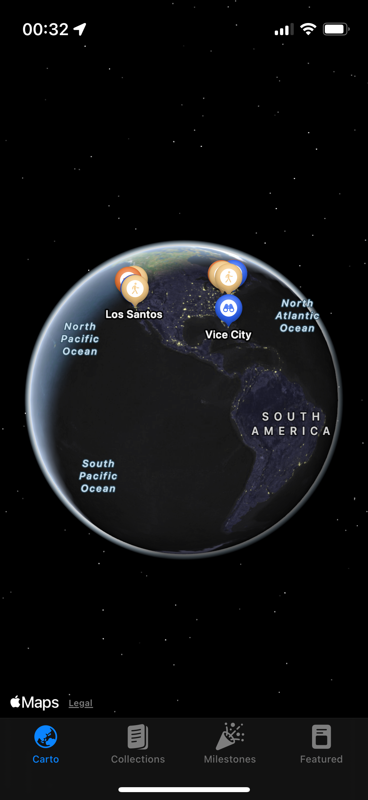
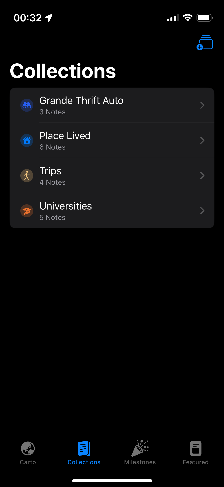
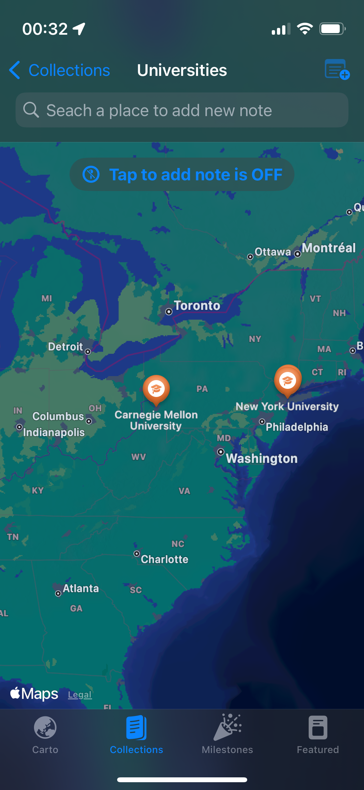
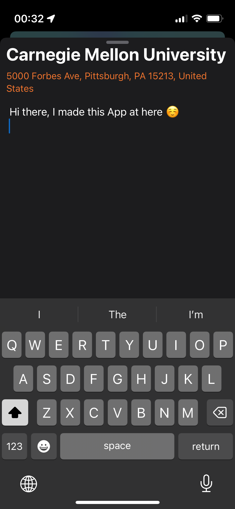
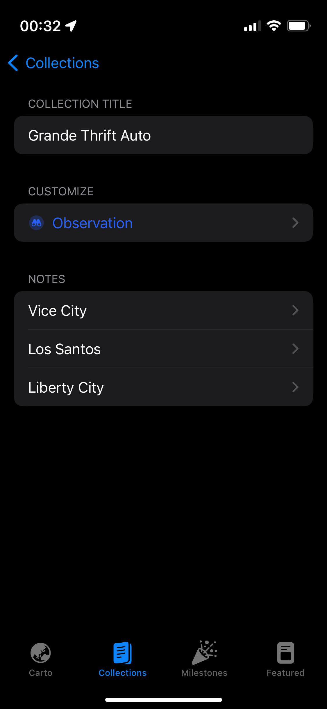
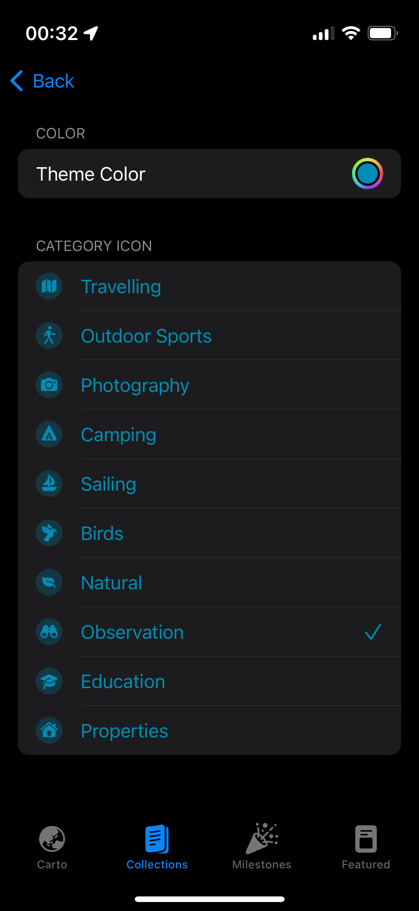

# Carto: A combination of map and note

Carto, a seamless blend of maps, notes, and a timeline function designed to enhance a personal and creative documentation. With this app, you can easily search for or tap to add a meaningful place-mark on the map and write notes at that specific location. Each note can be tagged with a date, transforming it into a chronicle of your experiences. Whether you’re capturing personal memories, documenting historical events, or crafting creative stories, Carto provides a unique and engaging way to map your world and time. Explore, document, and relive your moments with our dynamic map-note-timeline integration!

